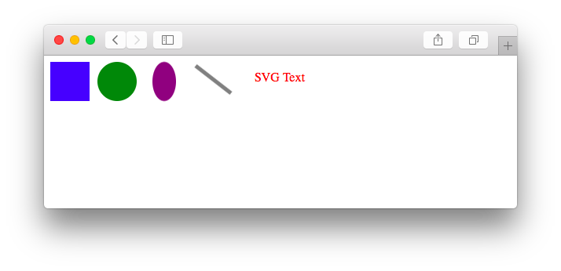
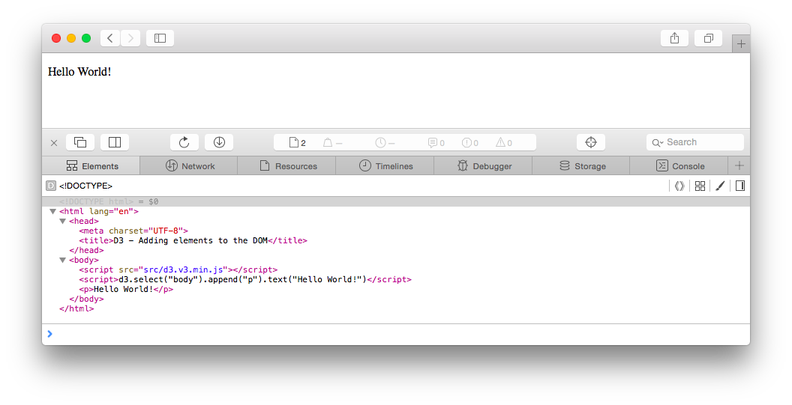
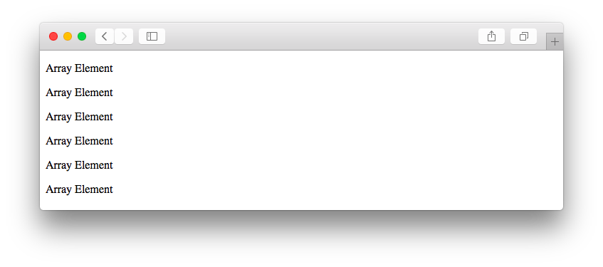
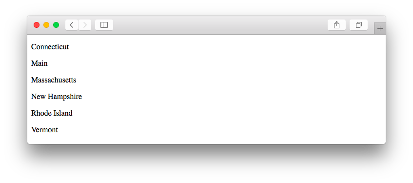
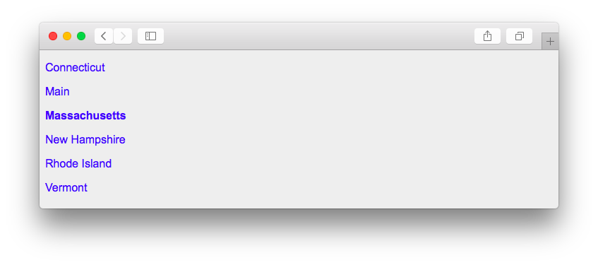
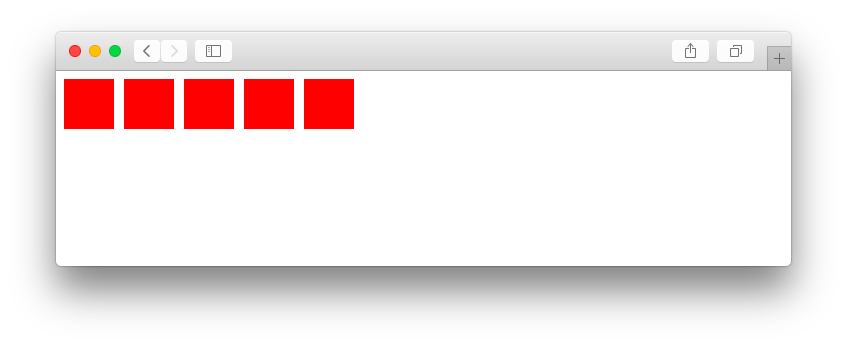
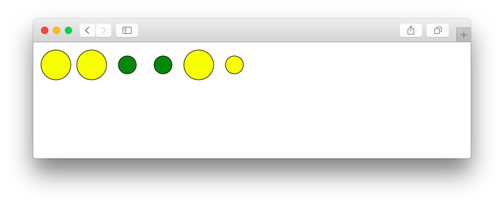
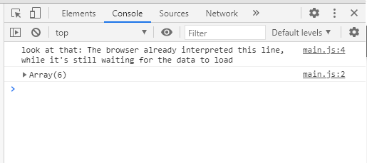
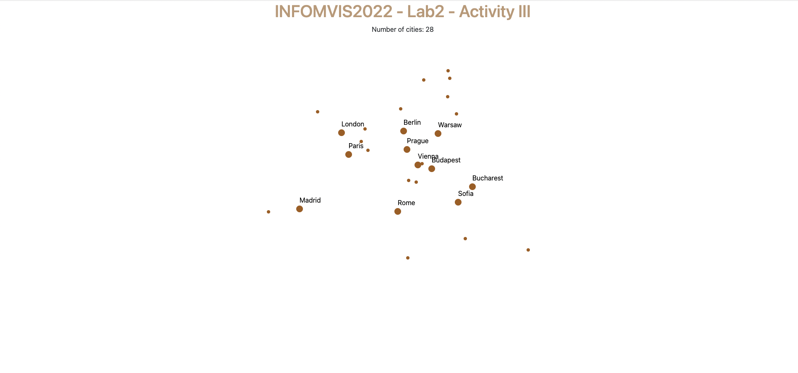

# Week 02 | Lab

### Learning Objectives

- Know how to use basic shape elements in SVG
- Advanced JS: *method chaining*; *anonymous functions*; first intuition about asynchronous execution & callbacks
- Know how to include D3 in your project
- Know the structure and syntax of a basic D3 visualization
- Know how to load data into D3
- Know how to bind data to visual elements

### Prerequisites

- You have read chapter 3 (p. 52-62) and chapter 5 (p. 67-72, p. 79-87)  in *D3 - Interactive Data Visualization for the Web*.
- You have downloaded the template for this week's lab on Surfdrive. This [link](https://surfdrive.surf.nl/files/index.php/s/y2KUQIVLS4jlwAN) should get you there quickly.

&nbsp;

Last week you have learned a lot about the fundamentals of web development. Now, you should be well prepared for the upcoming phase where you will work on interactive data visualizations with D3.


## D3 - First Steps

> ***D3.js (Document-Driven-Data) is a powerful JavaScript library for manipulating documents based on data.***
>
> "D3 allows you to bind arbitrary data to a Document Object Model (DOM), and then apply data-driven transformations to the document. For example, you can use D3 to generate an HTML table from an array of numbers. Or, use the same data to create an interactive SVG bar chart with smooth transitions and interaction." *(d3.js, Mike Bostock*)

A summary of D3's features and key aspects by *Scott Murray*:

- ***Loading*** data into the browser`s memory
- ***Binding*** data to elements within the document and creating new elements as needed
- ***Transforming*** those elements by interpreting each element's bound datum and setting its visual properties accordingly
- ***Transitioning*** elements between states in response to user input

*We will introduce all these concepts in the following weeks.*

&nbsp;


### D3 Version

**INFOMVIS2022 is using D3 version 7!**

Many of the changes in v5 - v7 address very specific issues that are not of relevance for you, and thus, the examples in the textbook (D3 v.4) still serve as
excellent references. Also, when looking up code online, be aware that many examples still use older versions and, as
a consequence, you might not be able to just copy paste the entire code -  you will need to make some changes! (The most
common one probably being the data loading part - since version 5, D3 uses promises, which makes things a lot smoother!) Check out
the different versions here:  [https://github.com/d3/d3/releases](https://github.com/d3/d3/releases)


### D3 Integration

*This is a brief overview of how to set up a basic D3 project. This should not be completely new but it might help you to solve the activity later.*

Before working with D3 you need to include the D3 JavaScript library first. When embedding it into your html, the source can either be local copy or a secure link to the latest d3 version online, i.e.  ```<script src="https://d3js.org/d3.v7.min.js"></script>```

Your file and folder structure for D3 projects should look like the following:

```
project/	
    index.html
    data/
        data.csv
        ..
    css/
        style.css
        ..
    js/
        main_presentation.js
        (other_js_libs.js)
        ..
```

&nbsp;

### An Overview of SVG (Scalable Vector Graphics)

- SVG is defined using markup code similar to HTML
- SVG elements don't lose any quality if they are resized
- SVG elements can be included directly within any HTML document or dynamically inserted into the DOM with JavaScript
- Before you can draw SVG elements you have to add an ```<svg>```-element with a specific width and height to your HTML document, for example: ```<svg width="500" height="500"></svg>```
- The SVG coordinate system places the origin (0/0) in the top-left corner of the svg element.
- SVG has no layering concept or depth property. The order in which elements are coded determines their depth order.


**Basic shape elements in SVG:** ```rect```, ```circle```, ```ellipse```, ```line```, ```text``` and ```path```

*Examples:*

```html
<svg width="400" height="50">

	<!-- Rectangle (x and y specify the coordinates of the upper-left corner -->
	<rect x="0" y="0" width="50" height="50" fill="blue" />

	<!-- Circle: cx and cy specify the coordinates of the center and r the radius -->
	<circle cx="85" cy="25" r="25" fill="green" />

	<!-- Ellipse: rx and ry specify separate radius values -->
	<ellipse cx="145" cy="25" rx="15" ry="25" fill="purple" />

	<!-- Line: x1,y1 and x2,y2 specify the coordinates of the ends of the line -->
	<line x1="185" y1="5" x2="230" y2="40" stroke="gray" stroke-width="5" />

	<!-- Text: x specifies the position of the left edge and y specifies the vertical position of the baseline -->
	<text x="260" y="25" fill="red">SVG Text</text>

</svg>
```

*Result:*



&nbsp;

### Adding a DOM Element with D3

In previous labs and homeworks, you have already worked with dynamic content and added new elements to the DOM tree, most likely with plain JavaScript or jQuery.

Now, we want to generate new page elements with D3. After loading the D3 library we can add our own script (e.g., main_presentation.js).

Our JS script (main_presentation.js) consists actually only of one line of code:

```
d3.select("body").append("p").text("Hello World!");
```

In this example we have used D3 to add a paragraph with the text "Hello World!" to a basic webpage.



Before going into further details we want to introduce the JS concept of *Method Chaining* briefly:

> **Method Chaining**
>
> Method or function chaining is a common technique in JS, especially when working with D3. It can be used to simplify code in scenarios that involve calling multiple methods on the same object consecutively.
>
> - The functions are "chained" together with periods.
> - The output type of one method has to match the input type expected by the next method in the chain.
>
> Alternative code without method chaining:
>
> ```javascript
> let body = d3.select("body");
> let p = body.append("p");
> p.text("Hello World!");
> ```
>
> *(We will use the chain syntax in most examples and templates)*

&nbsp;

**```d3```** - References the D3 object, so we can access its functions by starting our statement with: ```d3.```

#### D3 Select

The D3 *select()* method uses CSS selectors as an input to grab page elements (think of it as the d3 equivalent of ```document.getElementById()``` or ```document.querySelector()```). It will return a reference to the first element in the DOM that matches the selector.

In our example we have used ```d3.select("body")``` to select the first DOM element that matches our CSS selector: ```body```. Once an element is selected - and handed off to the next method in the chain - you can apply *operators*. These D3 operators allow you to get and set ***properties***, ***styles*** and ***content*** (and will again return the current selection).

*(Alternatively, if you want to select more than one element, use ```selectAll()```. We will try it later in an example.)*

#### D3 Append

After selecting a specific element we have used an operator to assign content: ```.append("p")```

The *append()* operator adds a new element as the last child of the current selection. We specified "p" as the input argument, so an empty paragraph has been added to the end of the *body*. The new paragraph is automatically selected for further operations.

At the end we have used the *text()* property to insert a string between the opening and closing tags of the current selection.

In summary, all methods together:

```javascript
d3.select("body")
		.append("p")
		.text("Hello World!");
```

*Your D3 statements can be much longer, so we recommend putting each method on its own indented line.*

-----

#### Activity I

1. **Download the Template for this week. [link](https://surfdrive.surf.nl/files/index.php/s/y2KUQIVLS4jlwAN)**

2. **Navigate to 'activity_1' and create a new D3 project inside the folder.**

   *At this point it might also be a good idea to create a boilerplate template project (i.e., directory structure) that you can copy every time you create a new project. The template project should include the directory structure for your project and all the files and boilerplate you usually need (e.g., D3 libraries, Bootstrap, etc.). In fact, in the template code for this week, we've included a folder named 'boilerplate' that contains such a boilerplate project. Feel free to use this as your starting point for your own custom boilerplate project.*

3. **Add an SVG rectangle to the HTML document**

   *CSS: width: 400px; height: 200px; color: green*

4. **Use D3 to add a ```div```-container with the text "Dynamic Content" to the DOM**

   *do this task in a separate JS file (e.g. main_presentation.js) that you embed in your HTML document*

-----

&nbsp;

### Binding Data to DOM Elements

> "Data visualization is a process of *mapping* data to visuals. (Scott Murray)

Similar to our last example we are using basic HTML *paragraphs*, but this time we append a new paragraph for each value in a given array:

```javascript
let states = ["Connecticut", "Main", "Massachusetts", "New Hampshire", "Rhode Island", "Vermont"];

let p = d3.select("body").selectAll("p")
		.data(states)
		.enter()
		.append("p")
		.text("Array Element");
```



(1) ```.select("body")``` - Reference to the target container

(2) ```.selectAll("p")``` - Selection representing the elements (paragraphs) we want to create

(3) ```.data(states)``` - Loads the dataset (here: array of strings). While the elements in the array may differ (strings, numbers, objects, other arrays), the data structure that D3's .data() method expects is an array. Each item of the array then gets assigned to each element of the current selection.

Instead of returning just the regular selection, the *data()* operator returns **three virtual selections**:

- **Enter** contains a new placeholder for any missing elements
- **Update** contains existing elements bound to the data
- **Exit** contains existing elements that are not bound to data anymore and should be removed

These three methods, along with merge() and join(), are powerful concepts in d3 and open up the floodgates for us to dynamcially handle updates to data. We will learn more about how to use them during Week 4's lab, but in the meantime, feel free to preview this content in Chapter 9 of *D3 - Interactive Data Visualization for the Web*.

There are no "p"-elements on the page so the **enter** selection contains placeholders for all elements in the array. In this and the following examples we will concentrate only on the *enter* selection. You will learn more about the enter-update-exit sequence when we are working with interactive datasets.

(4) ```.enter()``` - Creates new data-bound elements/placeholders

(5) ```.append("p")``` - Takes the empty placeholder selection and appends a paragraph to the DOM for each element.

(6) ```.text("Array Element")``` - Adds a string to each newly created paragraph


### Dynamic Properties

The dataset has been loaded and bound to new paragraphs but all the appended elements contain the same content: *"Array Element"*.

If you want access to the corresponding values from the dataset you have to use *anonymous functions*. For better readability, we'll provide an example in ES5 (JavaScipt v.5) first, before we rewrite it slightly using an ES6 arrow function.

```javascript
.text( function (d) { return d; } );
```

In this example we have included a JS function in the *text()* operator.

> **Anonymous Functions**
>
> A simple JS function looks like the following:
>
> ```javascript
> function doSomething (d) {
>   return d;
> }
> ```
> It has a function name, an input and an output variable. If the function name is missing, then it is called an *anonymous function*.
> If you want to use the function only in one place, an *anonymous function* like the one below is more concise than declaring a function and then doing something with it as two separate steps. We will use them very often in D3 to access individual values and to create interactive properties.
>
> ```javascript
> .text( function (d) { return d; } );
> ```

&nbsp;

> **Arrow Functions (ES6)**
>
>As mentioned above, ES6 introduced arrow functions, which allow us to write very neat anonymous functions. With regard to the syntax an arrow function replaces the word 'function' with an arrow:
> ```javascript
> .text( (d) => { return d; } );
> ``` 
> There are tons of implications if you change an anonymous ES5 function to an ES6 function. We encourage you to read up on the differences [here](https://www.w3schools.com/js/js_arrow_function.asp). One useful feature of arrow functions is their default return value if the function only has one statement. This allows us to shorten our anonymous function even more:
> ```javascript
> .text( d => d );
> ``` 
>

&nbsp;
In case you coded along with the example, this is how your website should look now that you've modified ```.text("Array Element")```:


In our case we are using the function to access individual values of the loaded array. That is one feature of D3: It can pass array/data elements and corresponding data indices to an anonymous function (which is called for each array element individually).
Generally in D3 documentation and tutorials, you'll see the parameter ```d``` used for the current data element and ```i```  (or ```index```) used for the index of the current data element. The index is passed in as the second element to the function calls and is optional.

Example for an anonymous function (in ES5) that passes the data element and index. Notice, that we are using ` for the return string rather than ' or " to make use of [template literals](https://developer.mozilla.org/en-US/docs/Web/JavaScript/Reference/Template_literals):

```javascript
.text( function(d, i){ 
    console.log('examining the parameters', d, i);
	return `element: ${d} at position: ${i}`; 
});
```

Example for an anonymous function (in ES6) that passes the data element and index:

```javascript
.text( (d, i) => { 
    console.log('examining the parameters', d, i);
	return `element: ${d} at position: ${i}`; 
});
```

Since it is still a regular function, it doesn't have to be just a simple return statement. We can use if-statements or loops to eventually return non-trivial values.

&nbsp;

### HTML attributes and CSS properties

As already mentioned earlier, we can get and set different **properties** and **styles** - not only the textual content. This becomes very important when working with SVG elements.

*Example (1) - Add paragraphs and set properties*

```javascript
let states = ["Connecticut", "Main", "Massachusetts", "New Hampshire", "Rhode Island", "Vermont"];

// Change the CSS property background (lightgray)
d3.select("body")
	.style("background-color", "#EEE");

// Append paragraphs and highlight one element
d3.select("body").selectAll("p")
	.data(states)
	.enter()
	.append("p")
	.text(d => d)
	.attr("class", "custom-paragraph")
	.style("color", "blue")
	.style("font-weight", d => {
		if(d === "Massachusetts")
			return "bold";
		else
			return "normal";
	});
```

- We use D3 to set the paragraph content, the HTML class, the font-color and as the last property, the font-weight which depends on the individual array value
- If you want to assign specific styles to the whole selection (e.g. font-color: blue), we recommend you to define an HTML class (*"custom-paragraph"* in our example) and add these rules in an external stylesheet. That will make your code concise and reusable.

*Result:*



*Example (2) - Add SVG rectangles and set properties*

```javascript
let numericData = [1, 2, 4, 8, 16];

// Add svg element (drawing space)
let svg = d3.select("body").append("svg")
	.attr("width", 300)
	.attr("height", 50);

// Add rectangle
svg.selectAll("rect")
	.data(numericData)
	.enter()
	.append("rect")
	.attr("fill", "red")
	.attr("width", 50)
	.attr("height", 50)
	.attr("y", 0)
	.attr("x", (d, i) => i * 60)
```
- We have appended SVG elements to the DOM tree in our second example. This means that we had to create the SVG drawing area first. We did this with D3 and saved the selection in the variable ```svg``` (in case you wonder why the ```d3``` object is missing in the second statement).
- It is crucial to set the SVG coordinates. If we don't set the *x* and *y* values, all the rectangles will be drawn on the same position at (0, 0). By using the index - of the current element in the selection - we can create a *dynamic x property* and shift every newly created rectangle 60px to the right.

*Result:*



-----

#### Activity II

1. **Navigate to 'activity_2' and create a new D3 project inside the folder.**

2. **Append a new SVG element to your HTML document with D3** (Width: 500px, Height: 500px)

3. **Draw circles with D3**

   Append a new **SVG circle** for every object in the following array:

   ```javascript
   let sandwiches = [
        { name: "Thesis", price: 7.95, size: "large" },
        { name: "Dissertation", price: 8.95, size: "large" },
        { name: "Highlander", price: 6.50, size: "small" },
        { name: "Just Tuna", price: 6.50, size: "small" },
        { name: "So-La", price: 7.95, size: "large" },
        { name: "Special", price: 12.50, size: "small" }
   ];
   ```

4. **Define dynamic properties**

	- Set the x/y coordinates and make sure that the circles don't overlap each other
	- Radius: *large sandwiches* should be twice as big as small ones
	- Colors: use two different circle colors. One color (```fill```) for cheap products < 7.00 USD and one for more expensive products
	- Add a border to every circle (SVG property: ```stroke```)

   *The result might look like the following:*
   

-----

&nbsp;


### Loading external data

Instead of typing the data in a local variable, which is also only convenient for small datasets,
we can use d3 fetches to load data from external files using promises. The D3 built-in methods make it
easy to load JSON, CSV and other files.

You should already be familiar with the JSON format from the previous lab and you have probably
worked with CSV files in the past, too.

> **CSV (Comma Separated Values)**
>
> Similar to JSON, CSV is a file format which is often used to exchange data. Each line in a CSV file represents a table row and as the name indicates, the values/columns are separated by a comma.
>
> In a nutshell: The use of the right file format depends on the data - JSON should be used for hierarchical data and CSV is usually a proper way to store tabular data.

We'll store the same sandwich price information in a CSV file. Most of the time CSV files are generated by exporting data from other applications, but for this example you should manually copy the data shown below into a blank file and save it as .CSV:

*sandwiches.csv (create this file in a subfolder of your project named "data")*

```csv
name,price,size
Thesis,7.95,large
Dissertation,8.95,large
Highlander,6.50,small
Just Tuna,6.50,small
So-La,7.95,large
Special,12.50,small
```

By calling D3 methods like *d3.csv()*, *d3.json()*, *d3.tsv()* etc. we can load external data resources in the browser:

```javascript
d3.csv("data/sandwiches.csv").then(function(data) {
  console.log(data); // [{name: "Thesis", price: "7.95", size: "large"},..]
});
```

> **Promises & Callbacks**
>
> *What are promises and why are they so useful?* → The page should be visible while data is loading and scripts that do not depend on the data should run immediately, while scripts that do depend on the data should only run once the data has been loaded! Promises allow for exactly that. The browser doesn't have to wait for the data to load but can continue to interpret the code because it can now rely on the promise that it'll get the data eventually.
>
> *OK, but what about callbacks. Why do I need those?* A callback function is a function that is passed to another function. It can be anonymous or named. We have used them multiple times before, for example to set the content:
>
> ```javascript
> .text(d => d)
> ```
> The *text()* method executes the anonymous callback function we have passed to it. That means, we don't call the anonymous function directly and it is also not getting executed immediately. It is invoked after some kind of event and usually it is "called back" once its parent function is complete.
>


*Updated main_presentation.js*

```javascript
d3.csv("data/sandwiches.csv").then(function(data) {
  console.log(data); // [{name: "Thesis", price: "7.95", size: "large"},..]
});
console.log(`look at that: The browser already interpreted this line, while it's still waiting for the data to load`)
```

*The result below shows that the execution order is different than what you might have expected:*

The callback function - the inner function of *d3.csv()* - is called only after the dataset is loaded completely to browser memory. In the meantime other scripts are executed.




-----

#### Activity III

1. **Navigate to 'activity_3' and create a new D3 project inside the folder.**

   *notice that there's already a folder called 'data' that contains your dataset for this exercies, i.e. `cities.csv`*

2. **Use D3 to load the CSV file**

   Write the data to the *web console* and inspect it in your browser:

	- In which format is the information stored now?
	- Which properties are available?
	- Check the types of the variables in the console

3. **Prepare the data**

   *You might have noticed that each value of the CSV file is stored as a string, including numerical values.*

	- Convert all numerical values to *numbers*. (Otherwise you might see unexpected behavior when making calculations.)
	- We recommend iterating over each row to convert strings into floats. You can use this neat line of code:

    ```javascript
            d.age = +d.age;
   ```

	- Formerly, you had to write an actual loop to iterate over each element in the array, i.e. each row in the csv. However, ever since switching to promises in d3 v5, [d3.csv](https://github.com/d3/d3-fetch) also allows for a callback during the process of loading the csv row by row. Thus, Mike Bostock, calls this an 'optional row conversion function':

   ```javascript
   d3.csv(url, (row) => {
   		// convert
   		row.value = +row.value
   		return row
   }).then( (data) => {
   	// check out the data and do whatever you want with it
   		console.log(data)
   })
   ```

4. **Filter the dataset**

   We are only interested in cities that are part of the *European Union (EU)*. In the remainder of the activity use the filtered dataset.

5. **Append a new paragraph to your HTML document**

   Count all elements in the filtered dataset and use D3 methods to write the result (i.e., the number of EU countries) to your webpage.

5. **Draw one SVG circle for each row in the filtered dataset**

	- All the elements (drawing area + circles) should be added dynamically with D3
	- SVG container: width = 700px, height = 550px
	- Use the x/y coordinates from the dataset to position the circles

7. **Dynamic circle properties**

   Change your default radius to a data-dependent value:

	- The radius should be **4px** for all cities with a population lower than 1.000.000.
	- The radius for all the other cities should be **8px**.

8. **Assign labels with the names of the European cities**

	- Use the *SVG text* element
	- All the elements should have the same class: ```city-label```
	- The labels should be only visible for cities with a population equal or higher than 1.000.000. You can use the SVG property ```opacity``` to solve this task.

9. **Styling**

   *Create a new external stylesheet if you have not done it yet.*

   Add proper styles to your webpage but include at least these CSS rules for the class ```city-label```:

	- Font size = 11px
	- Text anchor = middle

*Your result should look similar to this screenshot:*



*Important notice: This example is not intended to be a best practice example of how to work with D3 scales. It was designed to help you to get a better understanding of different basic concepts in D3.*

Next week you will learn how to create real scales for different types of data, you will work with more flexible size measurements and you will learn how to use D3 axes in your visualizations.

Later in this course you will also learn how to create interactive maps.

&nbsp;
	
-----

#### Bonus Activities (optional!)

- Add a **D3 click event listener**.

  The d3 method .on() adds or removes a listener to each selected element for the specified event typenames.
  The typenames is a string event type, such as click, mouseover, or submit. When a specified event is dispatched
  on a selected element, the specified listener will be evaluated for the element, being passed the current event
  (event) and the current datum (d), with this as the current DOM element (event.currentTarget). In order to have access
  to this, however, we cannot use arrow functions. Have a look at this event listener:

    ```javascript
    .on("click", function(event, d){
        console.log('check out what you have access to', event, d, this)
    });
    ```

  Of course, you can do more than just writing something to the console here. For example, you could call other functions and pass along
  some information from the current selection.


- Change the **hover style** of the SVG circles.

&nbsp;


-----

#### Submission of lab (only activity_3)

Congratulations, you have now completed the activities of Lab 2!

Please upload the code of your completed lab (only activity_3) on Surfdrive together with this week's homework. More instructions in the homework manual!


-----