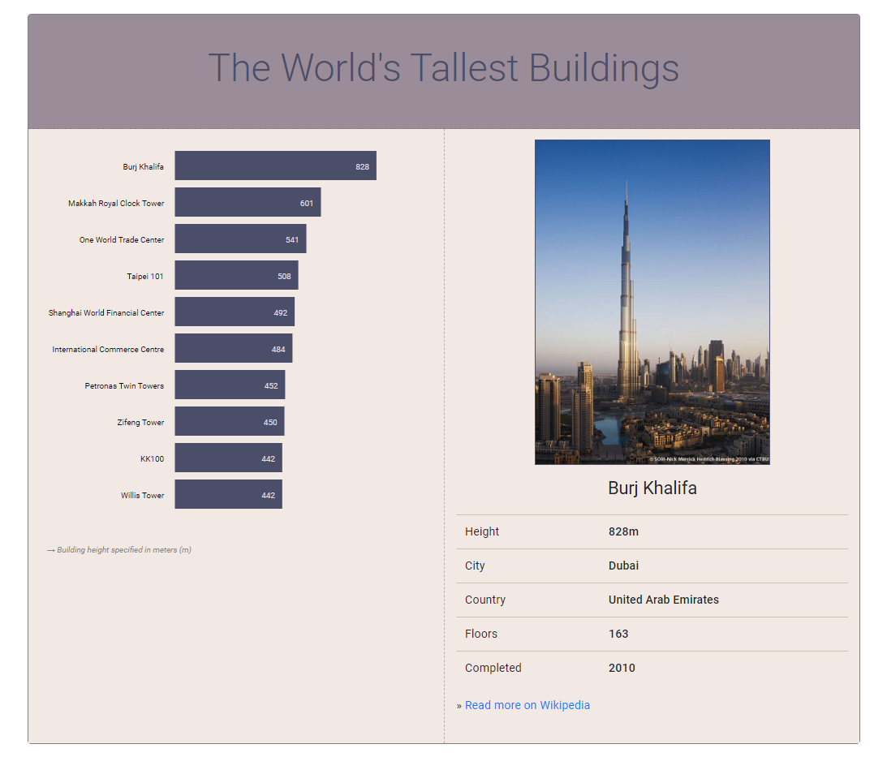

# Week 02 | Homework

This homework assumes that you have read and programmed along with chapter 3 (p. 53-62) and chapter 5 in *D3 - Interactive Data Visualization for the Web*.

&nbsp;

## 1) The World's Tallest Buildings

In this homework you will implement a horizontal bar chart with D3. Your bar chart will represent the ten tallest, fully-completed buildings in the world. Users will be able to click on a bar or label on the chart to get more information about a specific building.

*During development you can base your work on the following screenshot, but the design decisions (colors, fonts, ...) are principally up to you:*



### Data

We have provided a dataset with the world's tallest buildings. The CSV file (```buildings.csv```) includes a header row, which should help you to identify the different values, and a list of ten buildings.

The ```img``` folder contains an image in portrait format for each building.

### Implementation

1. **Download the resources**

	Please download the data (buildings.csv file) as well as the images. You'll find all files in the template ZIP for this week's hw on Surfdrive. This [link](https://surfdrive.surf.nl/files/index.php/s/xBZ3GC9Upr0xbBc) should get you there quickly.
	
2. **Set up a new D3 project and load the CSV file**
	
3. **Create a multi-column layout (HTML/CSS)**

	Split your page into multiple columns. The bar chart will be placed on the left side of the page while the right side will consist of a container that displays the dynamic content when the user selects a building in the bar chart. We strongly encourage you to use the *Bootstrap* [grid system](https://getbootstrap.com/docs/5.1/layout/grid/).
	
4. **Draw the SVG bar chart with D3**

	- Create a drawing area with at least 500 x 500px
	- Bind the loaded data to SVG rectangles (and place them correctly)
	- The bars should be left-aligned
	- Similar this week's lab, the different heights are given in pixels, so you don't have to use dynamic scales (data column: ```height_px```). That's something we'll cover in the next week.

5. **Add labels for** ***building names*** **and** ***height measures*** **to the bar chart**
	
	- The *building names* should be placed left of the bar chart and be right aligned (use the SVG text property ```text-anchor: end```). That means that you will have to shift your rectangles to the right, to avoid overlapping of text and rectangles. (Take a look at our example screenshot above to see how it should look.)
	- The labels for the *building heights* should be displayed inside the rectangles, at the right end of the bars.
	- Use proper font colors and sizes

	Note: If you are using the same HTML tags for different selections you have to work with *class attributes*. Here's an example:
	
	```javascript
	svg.selectAll("span.firstName")
		.data(data)
    	.enter()
    	.append("span")
    	.attr("class", "firstName")
		...
		
	svg.selectAll("span.age")
		.data(data)
    	.enter()
    	.append("span")
    	.attr("class", "age")
		...
	```
	
	We generally recommend that you use *class attributes*, and to add styling rules - which should affect the whole selection - to your external stylesheet.

6. **Sort the buildings in descending order by height**

	*Include your sorting algorithm directly after loading the data.*

7. **Make it interactive**

	*After selecting a specific building by clicking on the SVG labels or bars, 
	more detailed information should be presented to the user. That information
	should live in a separate column. Take a look at our solution screenshot to get some
	 inspiration.*

	Just like in the lab, you will have to use D3 *event listeners* to solve this task. 
	However, in the homework, you're supposed to do more than just firing a console.log. 
	We recommend writing a separate function that you call to take care of the task.
	
8. **Use good programming practices to structure your code**

	This is a good point to take a couple of minutes to think about your code. Is everything clear, well structured, and documented? Oftentimes moving a block of code into its own separate function goes a long way toward improving readability! Your code should be concise and easy to read. That not only reduces debugging time, but will allow you to understand your code when you come back to it in a couple of months.  Be kind to your future self!
	
	* Identify code that can easily be re-factored into separate functions. E.g. click event listeners for the rectangles and text currently behave the same way. That means you should probably have a single function that is called when clicking either on a rectangle or a building name.
	* Document all your functions, and make note of important points in the code. However, don't go overboard by documenting every line of code.
	* Use speaking variable names. Avoid using names like ```let temp_d``` or ```.div3```. Rather
	 use names like ```let sorted_buildings``` or ```.barchart```. 

9. **Use CSS to design your page**

	*Take care of an adequate spacing between your elements.*
	
	> We have used the *Google Font "Roboto"* in our example. If you are interested in using different fonts, this page might be helpful: [https://www.google.com/fonts](https://www.google.com/fonts)
	
10. **Check for bad practices**
    * Congratulations, you are done with the main task. Before moving on, however, make sure to
     skim your code for bad practices. This most and foremost means that your code is readable
      and includes comments where necessary. For your HTML code, we don't wanna see <br> tags
       anywhere in your code to space things out. Instead, make proper use of classes and ids
       . In your java script code, try using a forEach loop where possible and get comfortable
        with arrow functions.
    
## 2) Submit Homework in Surfdrive

Submission instructions:

1. Use the following recommended folder structure:

```
/submission_week-02_FirstnameLastname
    implementation/ ...folder for your code
        lab/             
                index.html
                css/ 		...folder with all CSS files
                js/ 		...folder with all JavaScript files\
                ..
        hw/
                index.html
                css/ 		...folder with all CSS files
                js/ 		...folder with all JavaScript files\
                ..
    
```
2. Upload a single .zip file.

4. Also submit the completed lab on Surfdrive.

**Congratulations for finishing the Homework! See you in class!**
